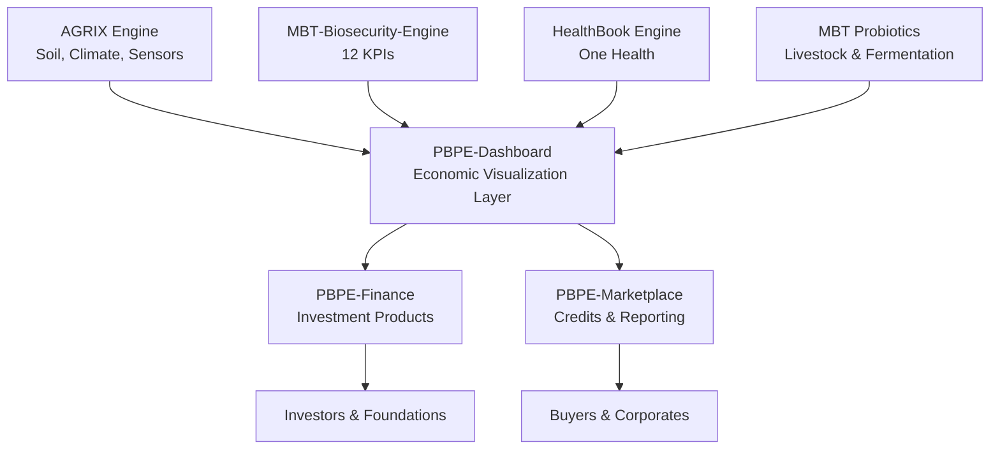

# 📘 **PBPE‑Dashboard**

### _Economic Visualization Layer of the Planetary Bio‑Positive Economy_

---

## 🌍 1. Introduction

**PBPE‑Dashboard** is the **economic visualization layer** of the  
**Planetary Bio‑Positive Economy (PBPE)**.

It transforms biological improvements generated by:

- **MBT‑Biosecurity‑Engine**
- **AGRIX Engine**
- **HealthBook Engine**
- **MBT Probiotics**

into **economic, climate, and social value metrics**.

PBPE‑Dashboard is where **regenerative agriculture becomes measurable finance**.

---

## 🧬 2. Purpose

PBPE‑Dashboard answers the core question:

> **“How much economic and climate value is created by biological regeneration?”**

It visualizes:

- Biosecurity impact
- Food loss reduction
- Soil carbon gains
- GHG reductions
- Farmer income uplift
- PBPE‑Biosecurity Credits
- Price stability
- ROI for investors and foundations

---

## 📊 3. The 12 Core PBPE KPIs

PBPE‑Dashboard displays the **12 universal indicators** that define  
biosecurity‑driven regenerative economics.

|#|KPI|Description|
|---|---|---|
|1|Disease Loss Reduction|% reduction in disease‑related yield loss|
|2|Yield Gain|% increase in crop yield|
|3|Quality Premium Score|Composite of Brix, polyphenols, defects|
|4|Anti‑Spoilage Effect|% reduction in post‑harvest spoilage|
|5|Food Loss Reduction|Increase in marketable yield|
|6|Cost Reduction Index|Fertilizer, pesticide, antibiotic, waste savings|
|7|Livestock Biosecurity Score|Infection, culling, antibiotics, FCR|
|8|Soil Carbon Sequestration (ΔC)|tC/ha increase|
|9|GHG Reduction|CH₄ + N₂O reduction (tCO₂e)|
|10|Price Stability Index|Reduction in price volatility|
|11|PBPE‑Biosecurity Value|Total economic value (USD)|
|12|Biosecurity ROI|Return on investment|

These KPIs are computed by **MBT‑Biosecurity‑Engine**  
and visualized by PBPE‑Dashboard.

---

## 🧱 4. Repository Structure

```
PBPE-Dashboard/
│
├── README.md
├── dashboard/
│     ├── pbpe_dashboard_app.py
│     ├── components/
│     ├── charts/
│     └── styles/
│
├── data/
│     ├── pbpe_data_model.json
│     └── sample_data.csv
│
└── api/
      ├── pbpe_value_api.md
      ├── credits_api.md
      └── integration_spec.md
```

---

## 🔗 5. Data Flow Architecture

PBPE‑Dashboard sits between **MBT‑Biosecurity‑Engine** and **PBPE‑Finance**.

### Mermaid.js Diagram



---

## 📦 6. Data Model (pbpe_data_model.json)

PBPE‑Dashboard consumes the unified schema defined in:

```
MBT-Biosecurity-Engine/08_Dashboard/Data_Model.json
```

Key entities:

- Farm
- Season
- CropPerformance
- PostHarvest
- SoilClimate
- Livestock
- Economics
- PBPECredits

This ensures **AGRIX → MBT55 → PBPE** is fully interoperable.

---

## 📈 7. Dashboard Pages

### **Page 1 — Global Overview**

- Total PBPE‑Biosecurity Value
- Total ΔC
- Total GHG Reduction
- Global Biosecurity Score
- Impact heatmap

### **Page 2 — Crop & Disease**

- Disease Loss Reduction
- Yield Gain
- Quality Premium Score
- Before/After charts

### **Page 3 — Post‑Harvest & Food Loss**

- Anti‑Spoilage Effect
- Food Loss Reduction
- Shelf‑Life Extension

### **Page 4 — Soil & Climate**

- ΔC (Soil Carbon)
- GHG Reduction
- Climate impact map

### **Page 5 — Livestock & One Health**

- Livestock Biosecurity Score
- Antibiotic reduction
- Enteric methane reduction

### **Page 6 — PBPE Value & ROI**

- PBPE‑Biosecurity Value
- ROI
- Price Stability Index
- Value breakdown

---

## 💱 8. PBPE‑Biosecurity Value Formula

PBPE‑Dashboard computes:

```
PBPE Value = 
    Disease Loss Reduction (USD)
  + Cost Reduction (USD)
  + Yield Gain (USD)
  + Quality Premium (USD)
  + Food Loss Reduction (USD)
  + Climate Credits (USD)
```

This is the **economic core** of PBPE.

---

## 🧩 9. Integration with PBPE‑Finance

PBPE‑Dashboard outputs:

- PBPE‑Biosecurity Credits
- Carbon Credits
- Food Loss Credits
- Quality Credits
- Price Stability Metrics

PBPE‑Finance uses these to create:

- Climate funds
- Biosecurity‑backed bonds
- Risk‑sharing instruments
- Results‑based finance

---

## 🔌 10. API Endpoints

### `POST /pbpe/value/calculate`

Input: 12 KPIs  
Output: PBPE‑Biosecurity Value, Credits

### `GET /pbpe/credits/{farm_id}`

Returns all credit types for a farm/season.

### `GET /pbpe/impact/global`

Returns aggregated global PBPE impact.

---

## 🧭 11. Vision

PBPE‑Dashboard is the **economic nervous system** of PBPE.

It transforms:

- Microbial ecology
- Soil regeneration
- Food system resilience
- Climate mitigation

into **transparent, measurable, investable value**.

This is how PBPE becomes a **planet‑scale economic engine**.
