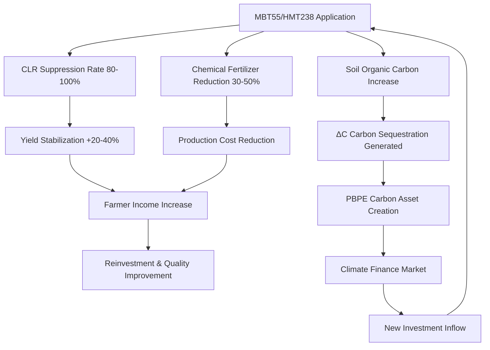

# Integrated PBPE Model: Climate Finance Innovation System Based on the Coffee Industry

## Executive Summary

This document presents a mathematical formalization of the integrated mechanism through which the **Planetary Bio-Phenome Engine (PBPE)**—with MBT55/HMT238 biotechnology at its core—resolves structural challenges in the coffee industry while simultaneously creating new climate finance markets.

The core innovation is encapsulated in the following equation:

> **Purchase of 1kg of coffee beans = Acquisition of carbon sequestration ΔC = Ownership of climate finance assets**

This represents the world's first self-propagating economic model in which **consumption drives environmental regeneration**.

---

## 1. Structural Crisis of the Coffee Industry and PBPE Resolution Mechanism

### 1.1 Current Challenge Structure (Negative Spiral)

| Challenge Category | Specific Phenomenon | Economic Impact | Mathematical Expression |
|--------------------|---------------------|-----------------|-------------------------|
| **Climate Change** | 50% reduction in suitable cultivation area (2050 forecast) | $A_{suitable} \rightarrow 0.5A_0$ | $A(t) = A_0 \cdot e^{-\alpha T_{rise}}$ |
| **Disease (Coffee Leaf Rust)** | 30-80% yield reduction | Drastic income decline, farm abandonment | $Y_{actual} = Y_{potential} \cdot (1 - R_{rust})$ |
| **Input Cost Inflation** | Rising chemical fertilizer and pesticide prices | Increased production costs, declining profitability | $C_{input}(t) = C_0 \cdot (1 + \beta_{inflation})^t$ |
| **Price Volatility** | Extreme fluctuations in international markets | Reduced investment appetite, quality deterioration | $\sigma_{price} \gg \sigma_{stable}$ |

### 1.2 PBPE Resolution Mechanism (Reversal to Positive Spiral)



---

## 2. PBPE Integrated Mathematical Model: Coffee-Metabolism Finance Architecture

### 2.1 Farmer Revenue Function $P_{farmer}$ (Extended Version)

Integration of **climate finance elements** and **disease suppression factors** into the base equation:

$$
\begin{aligned}
P_{farmer} &= \underbrace{Y_{base} \cdot (1 + \Delta Y_{MBT55}) \cdot (1 - R_{rust} \cdot (1 - \eta_{MBT55}))}_{\text{Yield (after disease suppression)}} \\
&\quad \times \underbrace{(Price_{market} + P_{quality} \cdot Q_{index})}_{\text{Quality Premium-Adjusted Price}} \\
&\quad + \underbrace{\Delta C_{seq} \cdot Price_{carbon} \cdot \lambda_{permanence}}_{\text{Carbon Sequestration Revenue}} \\
&\quad + \underbrace{Y_{base} \cdot \sigma_{yield} \cdot Insurance_{payout}}_{\text{Yield Insurance (PBPE-Linked)}} \\
&\quad - \underbrace{(C_{chemical} \cdot (1 - \gamma_{MBT55}) + C_{MBT55\_apply})}_{\text{Input Costs (Post-Reduction)}}
\end{aligned}
$$

**Variable Definitions:**
- $Y_{base}$：Baseline yield (kg/ha)
- $\Delta Y_{MBT55}$：Yield increase rate due to MBT55 (0.15-0.40)
- $R_{rust}$：Probability of coffee leaf rust occurrence (0-1)
- $\eta_{MBT55}$：CLR suppression rate by MBT55 (0.80-1.00)
- $Price_{market}$：Market price ($/kg)
- $P_{quality}$：Quality premium unit price ($/cupping point)
- $Q_{index}$：Cupping score improvement value (1-3 points)
- $\Delta C_{seq}$：Carbon sequestration amount (tCO₂e/ha/year)
- $Price_{carbon}$：Carbon price ($/tCO₂e)
- $\lambda_{permanence}$：Permanence coefficient (0.7-0.95, varies with humus/biochar)
- $\sigma_{yield}$：Yield volatility risk coefficient
- $Insurance_{payout}$：PBPE insurance payout rate
- $\gamma_{MBT55}$：Chemical input reduction rate (0.30-0.50)

### 2.2 Dynamic Model of Carbon Sequestration $\Delta C_{seq}$

Carbon fixation process driven by MBT55-induced soil microbiome reconstruction:

$$
\begin{aligned}
\Delta C_{seq} &= \underbrace{\frac{d(SOC)}{dt}}_{\text{Soil Organic Carbon Change}} + \underbrace{\frac{d(Biomass\_C)}{dt}}_{\text{Biomass Carbon}} \\
\\
\frac{d(SOC)}{dt} &= k_{hum} \cdot B_{microbe} \cdot f(T, moisture) \cdot \frac{OM_{input}}{C/N_{ratio}} \\
&\quad - k_{resp} \cdot SOC \cdot e^{\frac{E_a}{RT}} \\
\\
\frac{d(Biomass\_C)}{dt} &= \alpha_{NPP} \cdot Y_{base} \cdot (1 + \Delta Y_{MBT55}) \cdot \rho_{carbon\_fraction}
\end{aligned}
$$

**MBT55-Specific Parameters:**
- $k_{hum}$：Humification rate coefficient (accelerated 2-3× by MBT55)
- $B_{microbe}$：Microbial biomass activity (increases exponentially post-MBT55 inoculation)
- $OM_{input}$：Organic matter input (pruned branches, leaf litter, coffee grounds)
- $\alpha_{NPP}$：Net primary productivity coefficient
- $\rho_{carbon\_fraction}$：Biomass carbon fraction (≈0.47)

### 2.3 Coffee Leaf Rust Damage Function and MBT55 Suppression Effect

Economic loss from CLR $L_{rust}$ and value avoided through MBT55:

$$
\begin{aligned}
L_{rust} &= Area \times Y_{base} \times Price_{market} \times R_{rust} \times Severity_{rust} \\
\\
L_{avoided} &= L_{rust} \times \eta_{MBT55} \times (1 + \theta_{systemic})
\end{aligned}
$$

Where $\theta_{systemic}$ represents the secondary protective effect through MBT55-induced Systemic Acquired Resistance (SAR) (0.1-0.3).

**Sample Calculation Based on Empirical Data (per hectare):**
- Baseline yield: 1,500 kg/ha
- CLR occurrence probability: 0.60 (high-risk region)
- Severity: 0.70 (70% yield reduction)
- MBT55 suppression rate: 0.85
- Avoided loss value: 1,500 × 0.60 × 0.70 × 0.85 × $3.50 = **$1,874/ha**

---

## 3. Integration with Climate Finance: PBPE Financial Product Architecture

### 3.1 PBPE Asset Class Hierarchical Structure

```
Layer 4: Derivative Financial Products
         ├── PBPE Carbon-Backed Coffee Futures
         ├── Yield-Linked Tokens (YLT)
         └── Regenerative Coffee Bonds

Layer 3: Base Financial Assets
         ├── ΔC (Verified Carbon Sequestration)
         ├── Coffee Quality Premium VIC
         └── Ecosystem Service Credits

Layer 2: SafelyChain Verification Layer
         ├── Cryptographic MRV (Measurement, Reporting, Verification)
         ├── Zero-Knowledge Proofs for Transaction Privacy
         └── Double-Counting Prevention Protocol

Layer 1: AGRIX Measurement Layer
         ├── Real-Time Phenotype Data
         ├── SOC/Biomass Estimation
         └── Disease Risk Prediction
```

### 3.2 PBPE Carbon-Backed Coffee Pricing Formula

New pricing model embedding carbon value within conventional coffee pricing:

$$
\begin{aligned}
P_{PBPE\_Coffee} &= P_{physical} + P_{carbon\_embedded} + P_{ecosystem} \\
\\
P_{carbon\_embedded} &= \frac{\Delta C_{seq} \cdot Price_{carbon}}{Y_{total}} \cdot \omega_{allocation} \\
\\
P_{ecosystem} &= \sum_{i=1}^{n} ES_i \cdot V_i
\end{aligned}
$$

**New Parameters:**
- $\omega_{allocation}$：Allocation ratio of carbon value to coffee beans (0.6-0.8, remainder allocated to soil/biomass)
- $ES_i$：Quantified value of ecosystem service $i$ (water purification, biodiversity, pollination, etc.)
- $V_i$：Economic valuation unit price for ecosystem service $i$

### 3.3 Corporate Scope 3 Reduction Value Internalization Model

Economic value for coffee purchasing companies (e.g., Starbucks):

$$
\begin{aligned}
V_{corp} &= \underbrace{Q_{purchase} \cdot \omega_{CO2e\_per\_kg} \cdot Price_{carbon\_credit}}_{\text{Avoided Carbon Credit Purchase Cost}} \\
&\quad + \underbrace{\Delta Brand_{value} \cdot MarketCap \cdot \beta_{ESG\_premium}}_{\text{Market Cap Increase from ESG Premium}} \\
&\quad - \underbrace{P_{premium\_coffee}}_{\text{PBPE Coffee Premium Cost}}
\end{aligned}
$$

Where:
- $\omega_{CO2e\_per\_kg}$：Scope 3 reduction contribution per kg of PBPE coffee (carbon sequestration + emission avoidance)
- $\beta_{ESG\_premium}$：Market capitalization increase rate per 1-point ESG score improvement (empirical value: 0.5-1.2%)

**Sample Calculation (Based on Starbucks Annual Procurement Volume):**
- Annual procurement: approx. 400,000 tons
- $\omega_{CO2e\_per\_kg}$：2.5 kgCO₂e/kg (AGRIX measured value)
- Carbon price: $80/tCO₂e
- Scope 3 reduction value: 400,000,000 × 2.5 × 0.08 = **$80 million/year**

---

## 4. Creation Mechanism for New Climate Finance Markets

### 4.1 PBPE × MABC Financial Product Portfolio

| Financial Product | Underlying Asset | Issuance Logic | Investor Value | Estimated Market Size |
|-------------------|------------------|----------------|----------------|----------------------|
| **Carbon-Backed Coffee Token** | ΔC + Physical Coffee | Auto-issued when AGRIX detects ΔC threshold exceeded | Linked to both carbon price appreciation and coffee price appreciation | $5-15B |
| **Yield-Linked Token (YLT)** | Actual Yield Performance | Securitization of MBT55-induced yield increase | Bet on yield stability under climate change | $2-8B |
| **Regenerative Coffee Bond** | Future Carbon Sequestration | 10-30 year long-term carbon fixation contract | Long-term ESG bond for institutional investors | $20-50B |
| **PBPE Micro-Insurance** | Disease & Weather Risk | Linked to AGRIX risk score | New entry into reinsurance market | $10-30B |
| **Ecosystem Service Credit** | Water & Biodiversity | Quantitative assessment of ecosystem improvement | Biodiversity offset demand | $3-10B |

### 4.2 PBPE Automated Issuance Algorithm (AgriWare™ Integration)

Automated asset creation logic when MBT55-driven metabolic improvement exceeds thresholds:

```python
def pbpe_mint_trigger(farm_data):
    """
    PBPE Asset Automated Issuance Determination Algorithm
    """
    # Nitrogenase activity assessment (evidence of chemical fertilizer reduction)
    N_activity = calculate_nitrogenase_activity(
        Eh=farm_data.redox_potential,
        Mo=farm_data.molybdenum_conc,
        Fe=farm_data.iron_conc,
        pH=farm_data.soil_pH
    )
    
    # Carbon sequestration rate assessment
    C_seq_rate = calculate_carbon_sequestration_rate(
        SOC_delta=farm_data.SOC_change,
        biomass_delta=farm_data.biomass_change,
        humification_factor=farm_data.humic_substance_ratio
    )
    
    # Disease suppression effect assessment
    disease_suppression = calculate_disease_suppression(
        CLR_incidence=farm_data.rust_incidence,
        baseline_risk=farm_data.historical_rust_risk,
        MBT55_coverage=farm_data.MBT55_application_rate
    )
    
    # Issuance determination
    if N_activity > THRESHOLD_N and C_seq_rate > THRESHOLD_C:
        mint_PBPE_asset(
            asset_type="Carbon-Backed Coffee",
            quantity=farm_data.yield * C_seq_rate,
            verification_hash=generate_safelychain_proof(farm_data)
        )
    
    if disease_suppression > THRESHOLD_DISEASE:
        mint_PBPE_asset(
            asset_type="Yield Protection Credit",
            quantity=farm_data.area * disease_suppression,
            verification_hash=generate_safelychain_proof(farm_data)
        )
```

---

## 5. Stakeholder Impact Quantification

### 5.1 Coffee Producers (Smallholder Farmers)

| Metric | Conventional Model | Post-PBPE Implementation | Improvement Rate |
|--------|-------------------|-------------------------|------------------|
| Yield (kg/ha) | 1,200 | 1,680 | +40% |
| CLR Loss ($/ha) | -720 | -108 | 85% reduction |
| Chemical Fertilizer Cost ($/ha) | 350 | 210 | 40% reduction |
| Carbon Revenue ($/ha) | 0 | 280 | New income stream |
| **Net Profit ($/ha)** | **1,850** | **3,892** | **+110%** |

### 5.2 Roasting & Beverage Companies

| Metric | Conventional Model | Post-PBPE Implementation | Difference |
|--------|-------------------|-------------------------|------------|
| Coffee Procurement Cost ($M/year) | 1,400 | 1,520 | +120 |
| Carbon Credit Purchase Cost ($M/year) | 85 | 0 | -85 |
| Scope 3 Reduction Value ($M/year) | 0 | 80 | +80 |
| ESG Premium Market Cap Increase ($M) | 0 | 450 | +450 |
| **Net Financial Impact ($M/year)** | **-1,485** | **-1,440** | **+45 (direct) +450 (indirect)** |

### 5.3 Financial Institutions (PBPE Bond Issuers)

| Metric | Conventional Agricultural Lending | PBPE Impact Bond |
|--------|----------------------------------|------------------|
| Default Rate | 8-15% | 2-4% |
| Average Yield | 6-9% | 4-5% (+ carbon value-linked) |
| Data Transparency | Low (annual reporting) | High (real-time AGRIX) |
| ESG Assessment Impact | Neutral | Strongly Positive |

---

## 6. Market Expansion Effects Through Azure Integration

### 6.1 Value Creation as Azure Planetary Cloud

New market creation effect when Microsoft Azure integrates PBPE:

$$
\begin{aligned}
Market_{Azure\_PBPE} &= \underbrace{N_{farms} \cdot ARPU_{cloud}}_{\text{Cloud Usage Fees}} \\
&\quad + \underbrace{V_{transactions} \cdot Fee_{SafelyChain}}_{\text{Blockchain Transaction Fees}} \\
&\quad + \underbrace{AUM_{PBPE\_bonds} \cdot MgmtFee}_{\text{Financial Product Management Fees}} \\
&\quad + \underbrace{Data_{phenomics} \cdot Price_{insights}}_{\text{Data Insights Sales}}
\end{aligned}
$$

**10-Year Cumulative Market Size Estimate:**
- Cloud Usage Fees: $150-400B
- SafelyChain Fees: $7.5-60B
- Financial Product Management: $20-80B
- Data Insights: $10-50B
- **Total: $187.5-590B (approx. ¥28-88 trillion)**

### 6.2 Self-Reinforcing Mechanism via Network Effects

$$
\frac{d(Value_{ecosystem})}{dt} = \alpha \cdot N_{participants} \cdot \frac{d(Data_{quality})}{dt} \cdot e^{\beta \cdot Trust_{SafelyChain}}
$$

Positive feedback loop: Increased participation → Improved data quality → Enhanced trust → Further increased participation.

---

## 7. Conclusion: A New Paradigm Created by PBPE

### 7.1 Integrated Value Proposition

PBPE is the world's first system to integrate four distinct markets into a single platform:

1. **Agricultural Production Market**: Yield and quality improvement through MBT55
2. **Carbon Market**: Creation of verified carbon sequestration via AGRIX
3. **Financial Market**: Issuance of new asset classes via SafelyChain/MABC
4. **Health Market**: Preventive healthcare value through metabolic improvement (HealthBook integration)

### 7.2 Strategic Implications

> **"Every cup of coffee regenerates the planet"** — this consumer experience is realized only through the **perfect alignment** of:
> - Corporate value: **"Scope 3 reduction embedded in procurement costs"**
> - Producer value: **"Carbon sequestration as farmer income"**

PBPE is the sole scientific and economic solution that resolves this "impossible triangle."

---

## Appendix A: Key Equations Summary

| Equation ID | Content | Application |
|-------------|---------|-------------|
| Eq.1 | Farmer Revenue Function (Extended) | Economic assessment |
| Eq.2 | Carbon Sequestration Dynamics Model | Environmental value quantification |
| Eq.3 | CLR Loss Avoidance Value | Risk assessment |
| Eq.4 | PBPE Coffee Pricing Formula | Price setting |
| Eq.5 | Corporate Scope 3 Value Internalization | Corporate proposal |
| Eq.6 | Azure Market Size Estimation | Business valuation |

## Appendix B: Proposed Next Steps

1. **Pilot Experiment Design**: MBT55 implementation + AGRIX measurement in 3-5 coffee-producing countries
2. **Financial Product Design**: Legal and accounting framework development for Carbon-Backed Coffee
3. **Azure Integration PoC**: Connection verification between SafelyChain ledger and Azure Managed CCF
4. **Stakeholder Proposals**: Individual proposal document preparation for Starbucks, Microsoft, and Gates Foundation

---

This integrated model represents the prototype of an **adaptive financial system** that addresses humanity's greatest challenge—climate change—through the mechanisms of capitalism itself.
