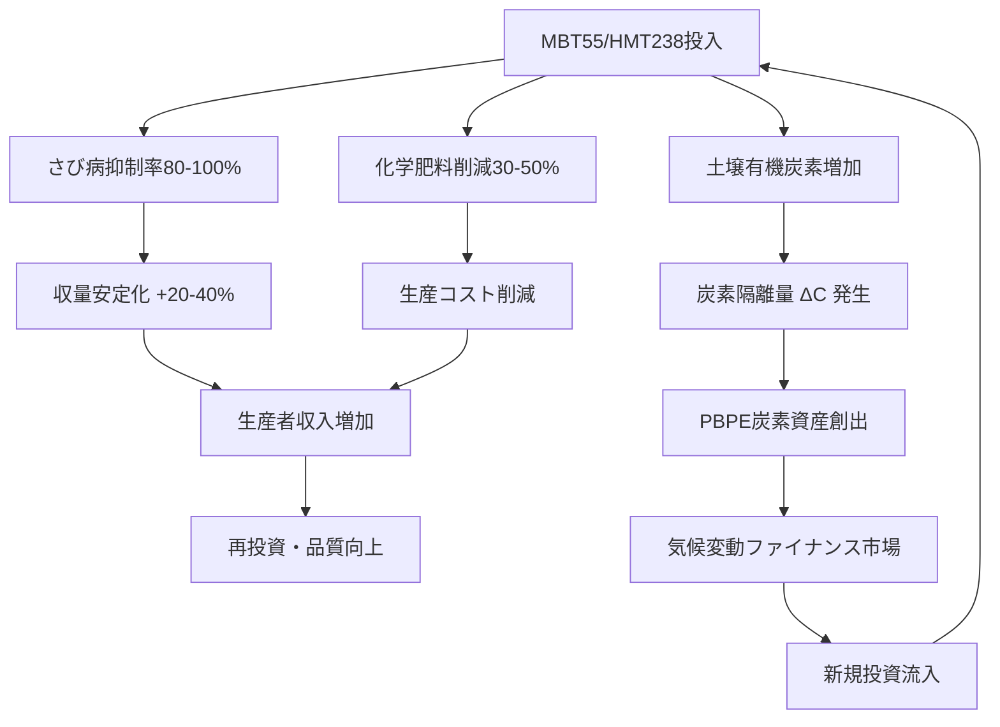

# 統合的PBPEモデル：コーヒー産業を基軸とした気候変動ファイナンス革新体系

## Executive Summary

本ドキュメントは、MBT55/HMT238バイオテクノロジーを中核とする**Planetary Bio-Phenome Engine（PBPE）**が、コーヒー産業の構造的課題を解決し、同時に新たな気候変動ファイナンス市場を創出する統合的メカニズムを数理モデル化したものです。

核心的革新は以下の等式に集約されます：

> **コーヒー豆1kgの購入 = 炭素隔離量 ΔC の取得 = 気候変動ファイナンス資産の保有**

これは「消費が環境再生を駆動する」世界初の自己増殖的経済モデルです。

---

## 1. コーヒー産業の構造的危機とPBPEによる解決メカニズム

### 1.1 現状の課題構造（ネガティブ・スパイラル）

| 課題カテゴリ | 具体的事象 | 経済的影響 | 数式表現 |
|-------------|-----------|-----------|---------|
| **気候変動** | 栽培適地の半減（2050年予測） | 生産可能面積 $A_{suitable} \rightarrow 0.5A_0$ | $A(t) = A_0 \cdot e^{-\alpha T_{rise}}$ |
| **病害（さび病）** | 収量30-80%減 | 生産者収入激減、廃業加速 | $Y_{actual} = Y_{potential} \cdot (1 - R_{rust})$ |
| **資材高騰** | 化学肥料・農薬価格上昇 | 生産コスト増、収益性悪化 | $C_{input}(t) = C_0 \cdot (1 + \beta_{inflation})^t$ |
| **価格変動** | 国際市況の乱高下 | 投資意欲減退、品質低下 | $\sigma_{price} \gg \sigma_{stable}$ |

### 1.2 PBPEによる解決メカニズム（ポジティブ・スパイラルへの反転）



---

## 2. PBPE統合数理モデル：Coffee-Metabolism Finance Architecture

### 2.1 生産者収益関数 $P_{farmer}$（拡張版）

基本式に**気候変動ファイナンス要素**と**病害抑制要素**を統合：

$$
\begin{aligned}
P_{farmer} &= \underbrace{Y_{base} \cdot (1 + \Delta Y_{MBT55}) \cdot (1 - R_{rust} \cdot (1 - \eta_{MBT55}))}_{\text{収量（病害抑制後）}} \\
&\quad \times \underbrace{(Price_{market} + P_{quality} \cdot Q_{index})}_{\text{品質プレミアム付価格}} \\
&\quad + \underbrace{\Delta C_{seq} \cdot Price_{carbon} \cdot \lambda_{permanence}}_{\text{炭素隔離報酬}} \\
&\quad + \underbrace{Y_{base} \cdot \sigma_{yield} \cdot Insurance_{payout}}_{\text{収量保険（PBPE連動）}} \\
&\quad - \underbrace{(C_{chemical} \cdot (1 - \gamma_{MBT55}) + C_{MBT55\_apply})}_{\text{投入コスト（削減後）}}
\end{aligned}
$$

**変数定義：**
- $Y_{base}$：基準収量 (kg/ha)
- $\Delta Y_{MBT55}$：MBT55による収量増加率（0.15-0.40）
- $R_{rust}$：さび病発生確率（0-1）
- $\eta_{MBT55}$：MBT55によるさび病抑制率（0.80-1.00）
- $Price_{market}$：市場価格 ($/kg)
- $P_{quality}$：品質プレミアム単価 ($/cupping point)
- $Q_{index}$：カッピングスコア向上値（1-3 points）
- $\Delta C_{seq}$：炭素隔離量 (tCO₂e/ha/year)
- $Price_{carbon}$：炭素価格 ($/tCO₂e)
- $\lambda_{permanence}$：永続性係数（0.7-0.95、腐植・バイオ炭で変動）
- $\sigma_{yield}$：収量変動リスク係数
- $Insurance_{payout}$：PBPE保険支払率
- $\gamma_{MBT55}$：化学資材削減率（0.30-0.50）

### 2.2 炭素隔離量の動的モデル $\Delta C_{seq}$

MBT55による土壌微生物相の再構築が駆動する炭素固定プロセス：

$$
\begin{aligned}
\Delta C_{seq} &= \underbrace{\frac{d(SOC)}{dt}}_{\text{土壌有機炭素変化}} + \underbrace{\frac{d(Biomass\_C)}{dt}}_{\text{バイオマス炭素}} \\
\\
\frac{d(SOC)}{dt} &= k_{hum} \cdot B_{microbe} \cdot f(T, moisture) \cdot \frac{OM_{input}}{C/N_{ratio}} \\
&\quad - k_{resp} \cdot SOC \cdot e^{\frac{E_a}{RT}} \\
\\
\frac{d(Biomass\_C)}{dt} &= \alpha_{NPP} \cdot Y_{base} \cdot (1 + \Delta Y_{MBT55}) \cdot \rho_{carbon\_fraction}
\end{aligned}
$$

**MBT55特異的パラメータ：**
- $k_{hum}$：腐植化速度係数（MBT55により2-3倍に加速）
- $B_{microbe}$：微生物バイオマス活性（MBT55接種後、指数関数的に増加）
- $OM_{input}$：有機物投入量（剪定枝、落葉、コーヒー粕）
- $\alpha_{NPP}$：純一次生産性係数
- $\rho_{carbon\_fraction}$：バイオマス炭素含有率（≈0.47）

### 2.3 さび病被害関数とMBT55抑制効果

さび病による経済損失 $L_{rust}$ とMBT55による回避額：

$$
\begin{aligned}
L_{rust} &= Area \times Y_{base} \times Price_{market} \times R_{rust} \times Severity_{rust} \\
\\
L_{avoided} &= L_{rust} \times \eta_{MBT55} \times (1 + \theta_{systemic})
\end{aligned}
$$

ここで $\theta_{systemic}$ はMBT55の全身獲得抵抗性（SAR）誘導による二次的保護効果（0.1-0.3）。

**実証データに基づく試算例（1haあたり）：**
- 基準収量：1,500 kg/ha
- さび病発生確率：0.60（高リスク地域）
- 重症度：0.70（収量70%減）
- MBT55抑制率：0.85
- 回避損失額：1,500 × 0.60 × 0.70 × 0.85 × $3.50 = **$1,874/ha**

---

## 3. 気候変動ファイナンスとの統合：PBPE金融商品アーキテクチャ

### 3.1 PBPE資産クラス階層構造

```
Layer 4: デリバティブ金融商品
         ├── PBPE Carbon-Backed Coffee Futures
         ├── Yield-Linked Tokens (YLT)
         └── Regenerative Coffee Bonds

Layer 3: 基礎金融資産
         ├── ΔC（検証済み炭素隔離量）
         ├── Coffee Quality Premium VIC
         └── Ecosystem Service Credits

Layer 2: SafelyChain検証レイヤー
         ├── 暗号的MRV（Measurement, Reporting, Verification）
         ├── ゼロ知識証明による取引秘匿性
         └── 二重計上防止プロトコル

Layer 1: AGRIX計測レイヤー
         ├── リアルタイムフェノタイプデータ
         ├── SOC/バイオマス推定
         └── 病害リスク予測
```

### 3.2 PBPE Carbon-Backed Coffee 価格決定式

従来のコーヒー価格に炭素価値を内包させた新価格モデル：

$$
\begin{aligned}
P_{PBPE\_Coffee} &= P_{physical} + P_{carbon\_embedded} + P_{ecosystem} \\
\\
P_{carbon\_embedded} &= \frac{\Delta C_{seq} \cdot Price_{carbon}}{Y_{total}} \cdot \omega_{allocation} \\
\\
P_{ecosystem} &= \sum_{i=1}^{n} ES_i \cdot V_i
\end{aligned}
$$

**新規パラメータ：**
- $\omega_{allocation}$：炭素価値のコーヒー豆への配分比率（0.6-0.8、残りは土壌・バイオマスへ）
- $ES_i$：生態系サービス $i$ の定量値（水質浄化、生物多様性、花粉媒介等）
- $V_i$：生態系サービス $i$ の経済評価単価

### 3.3 企業側Scope 3削減価値の内部化モデル

コーヒー購入企業（スターバックス等）にとっての経済的価値：

$$
\begin{aligned}
V_{corp} &= \underbrace{Q_{purchase} \cdot \omega_{CO2e\_per\_kg} \cdot Price_{carbon\_credit}}_{\text{排出権購入回避額}} \\
&\quad + \underbrace{\Delta Brand_{value} \cdot MarketCap \cdot \beta_{ESG\_premium}}_{\text{ESGプレミアムによる時価総額増加}} \\
&\quad - \underbrace{P_{premium\_coffee}}_{\text{PBPEコーヒー追加コスト}}
\end{aligned}
$$

ここで：
- $\omega_{CO2e\_per\_kg}$：PBPEコーヒー1kgあたりのScope 3削減貢献量（炭素隔離＋排出回避）
- $\beta_{ESG\_premium}$：ESG評価1ポイント向上あたりの時価総額増加率（実証値：0.5-1.2%）

**試算例（スターバックス年間調達量ベース）：**
- 年間調達量：約40万トン
- $\omega_{CO2e\_per\_kg}$：2.5 kgCO₂e/kg（AGRIX実測値）
- 炭素価格：$80/tCO₂e
- Scope 3削減価値：400,000,000 × 2.5 × 0.08 = **$80 million/年**

---

## 4. 新規気候変動ファイナンス市場の創出メカニズム

### 4.1 PBPE × MABC 金融商品ポートフォリオ

| 金融商品 | 原資産 | 発行ロジック | 投資家価値 | 市場規模推定 |
|---------|--------|-------------|-----------|-------------|
| **Carbon-Backed Coffee Token** | ΔC + コーヒー現物 | AGRIXがΔC閾値超過時に自動発行 | 炭素価格上昇＋コーヒー価格上昇の両方に連動 | $5-15B |
| **Yield-Linked Token (YLT)** | 収量実績 | MBT55による収量増加分を証券化 | 気候変動下での収量安定性へのベット | $2-8B |
| **Regenerative Coffee Bond** | 将来炭素隔離量 | 10-30年の長期炭素固定契約 | 機関投資家向け長期ESG債 | $20-50B |
| **PBPE Micro-Insurance** | 病害・気象リスク | AGRIXリスクスコア連動 | 再保険市場への新規参入 | $10-30B |
| **Ecosystem Service Credit** | 水・生物多様性 | 生態系改善の定量評価 | 生物多様性オフセット需要 | $3-10B |

### 4.2 PBPE自動発行アルゴリズム（AgriWare™連動）

MBT55による代謝改善が閾値を超えた際の自動資産化ロジック：

```python
def pbpe_mint_trigger(farm_data):
    """
    PBPE資産自動発行判定アルゴリズム
    """
    # ニトロゲナーゼ活性評価（化学肥料削減の証拠）
    N_activity = calculate_nitrogenase_activity(
        Eh=farm_data.redox_potential,
        Mo=farm_data.molybdenum_conc,
        Fe=farm_data.iron_conc,
        pH=farm_data.soil_pH
    )
    
    # 炭素固定速度評価
    C_seq_rate = calculate_carbon_sequestration_rate(
        SOC_delta=farm_data.SOC_change,
        biomass_delta=farm_data.biomass_change,
        humification_factor=farm_data.humic_substance_ratio
    )
    
    # 病害抑制効果評価
    disease_suppression = calculate_disease_suppression(
        CLR_incidence=farm_data.rust_incidence,
        baseline_risk=farm_data.historical_rust_risk,
        MBT55_coverage=farm_data.MBT55_application_rate
    )
    
    # 発行判定
    if N_activity > THRESHOLD_N and C_seq_rate > THRESHOLD_C:
        mint_PBPE_asset(
            asset_type="Carbon-Backed Coffee",
            quantity=farm_data.yield * C_seq_rate,
            verification_hash=generate_safelychain_proof(farm_data)
        )
    
    if disease_suppression > THRESHOLD_DISEASE:
        mint_PBPE_asset(
            asset_type="Yield Protection Credit",
            quantity=farm_data.area * disease_suppression,
            verification_hash=generate_safelychain_proof(farm_data)
        )
```

---

## 5. ステークホルダー別インパクト定量化

### 5.1 コーヒー生産者（小規模農家）

| 指標 | 従来モデル | PBPE導入後 | 改善率 |
|------|-----------|-----------|--------|
| 収量 (kg/ha) | 1,200 | 1,680 | +40% |
| さび病損失 ($/ha) | -720 | -108 | 85%削減 |
| 化学肥料コスト ($/ha) | 350 | 210 | 40%削減 |
| 炭素報酬 ($/ha) | 0 | 280 | 新規収入源 |
| **純利益 ($/ha)** | **1,850** | **3,892** | **+110%** |

### 5.2 焙煎・飲料企業

| 指標 | 従来モデル | PBPE導入後 | 差額 |
|------|-----------|-----------|------|
| コーヒー調達コスト (百万$/年) | 1,400 | 1,520 | +120 |
| 排出権購入コスト (百万$/年) | 85 | 0 | -85 |
| Scope 3削減価値 (百万$/年) | 0 | 80 | +80 |
| ESGプレミアム時価総額増 (百万$) | 0 | 450 | +450 |
| **ネット財務インパクト (百万$/年)** | **-1,485** | **-1,440** | **+45（直接）+450（間接）** |

### 5.3 金融機関（PBPE債発行体）

| 指標 | 従来農業融資 | PBPEインパクトボンド |
|------|-------------|---------------------|
| デフォルト率 | 8-15% | 2-4% |
| 平均利回り | 6-9% | 4-5%（＋炭素価値連動） |
| データ透明性 | 低（年次報告） | 高（リアルタイムAGRIX） |
| ESG評価インパクト | 中立 | 強ポジティブ |

---

## 6. Azure統合による市場規模拡大効果

### 6.1 Azure Planetary Cloudとしての価値創出

Microsoft AzureがPBPEを統合した場合の新規市場創出効果：

$$
\begin{aligned}
Market_{Azure\_PBPE} &= \underbrace{N_{farms} \cdot ARPU_{cloud}}_{\text{クラウド利用料}} \\
&\quad + \underbrace{V_{transactions} \cdot Fee_{SafelyChain}}_{\text{ブロックチェーン手数料}} \\
&\quad + \underbrace{AUM_{PBPE\_bonds} \cdot MgmtFee}_{\text{金融商品運用手数料}} \\
&\quad + \underbrace{Data_{phenomics} \cdot Price_{insights}}_{\text{データインサイト販売}}
\end{aligned}
$$

**10年累計市場規模試算：**
- クラウド利用料：$150-400B
- SafelyChain手数料：$7.5-60B
- 金融商品運用：$20-80B
- データインサイト：$10-50B
- **合計：$187.5-590B（約28-88兆円）**

### 6.2 ネットワーク効果による自己強化メカニズム

$$
\frac{d(Value_{ecosystem})}{dt} = \alpha \cdot N_{participants} \cdot \frac{d(Data_{quality})}{dt} \cdot e^{\beta \cdot Trust_{SafelyChain}}
$$

参加者増加 → データ品質向上 → 信頼性向上 → 更なる参加者増加、という正のフィードバックループ。

---

## 7. 結論：PBPEが創出する新パラダイム

### 7.1 統合的価値提案

PBPEは以下の4つの市場を単一のプラットフォームに統合する世界初のシステムです：

1. **農業生産市場**：MBT55による収量・品質向上
2. **炭素市場**：AGRIXによる検証済み炭素隔離量の創出
3. **金融市場**：SafelyChain/MABCによる新資産クラスの発行
4. **健康市場**：代謝改善による予防医療価値（HealthBook連携）

### 7.2 戦略的示唆

> **「コーヒー1杯が地球を再生する」** という消費者体験は、  
> **「Scope 3削減が調達コストに内包される」** という企業価値と、  
> **「炭素隔離が農家収入になる」** という生産者価値の、  
> **三者完全一致**によって初めて実現します。

PBPEはこの「不可能な三角形」を解く、唯一の科学的・経済的ソリューションです。

---

## Appendix A: 主要数式一覧

| 数式ID | 内容 | 用途 |
|--------|------|------|
| Eq.1 | 生産者収益関数（拡張版） | 経済性評価 |
| Eq.2 | 炭素隔離動態モデル | 環境価値定量 |
| Eq.3 | さび病損失回避額 | リスク評価 |
| Eq.4 | PBPEコーヒー価格決定式 | 価格設定 |
| Eq.5 | 企業Scope 3価値内部化 | 企業提案 |
| Eq.6 | Azure市場規模試算 | 事業評価 |

## Appendix B: 想定される次ステップ

1. **実証実験設計**：3-5カ国のコーヒー産地でMBT55導入＋AGRIX計測
2. **金融商品設計**：Carbon-Backed Coffeeの法的・会計的枠組み構築
3. **Azure統合PoC**：SafelyChain台帳とAzure Managed CCFの接続検証
4. **ステークホルダー提案**：スターバックス、Microsoft、Gates Foundationへの個別提案書作成

---

この統合モデルは、気候変動という人類最大の課題を、資本主義のメカニズムを通じて解決する「適応的金融システム」の雛形です。
